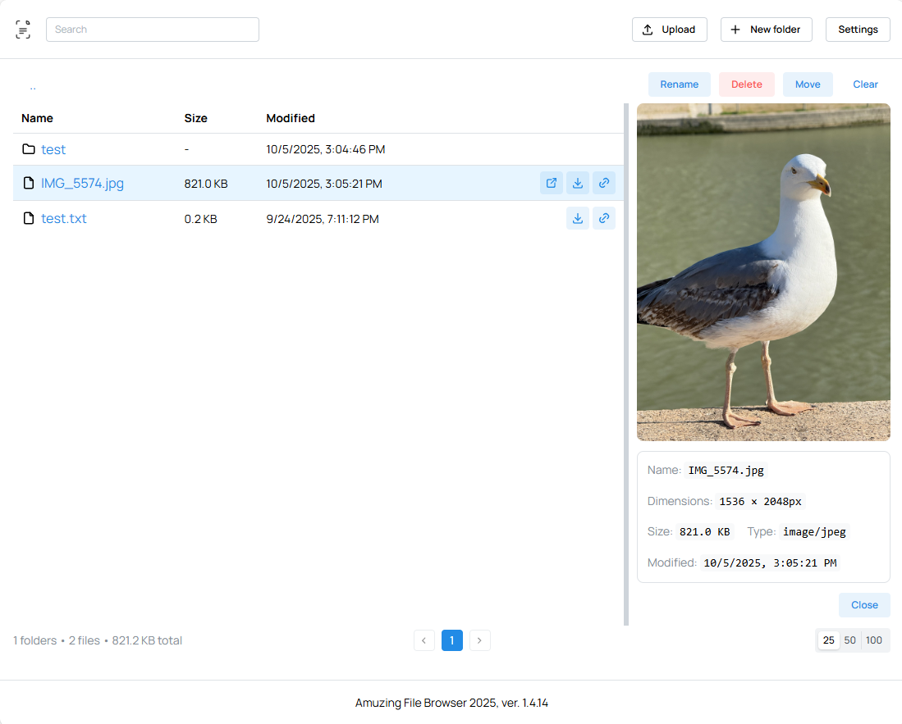

# Amuzing File Browser

    



A minimal file browser you can run locally, in Docker and on Kubernetes. It serves a directory for listing, uploading, deleting, renaming, moving, creating folders, downloading, and previewing files (images including WebP). No auth.

### Background

Before starting this project, I have checked what is already existed. I found multiple apps including [gtsteffaniak's File Browser](https://github.com/gtsteffaniak/filebrowser). Even so it is a great tool so far, it is a bit overcomplicated for me and my needs. So I decided to make my own simple file browser.

It is mostly vibe-coded project with Windsurf AI as I am not a developer, so I strongly recommend to check [gtsteffaniak's File Browser](https://github.com/gtsteffaniak/filebrowser) for more features. You may use this project on your own risk. I do not take any responsibility for any damage or loss of your data.

All suggestions, bug reports, and pull requests are welcome.

## Features

- Directory listing with sorting (name/size/modified) and pagination
- Upload (multipart, with progress and cancel), download files
- Create folder, rename, bulk move and bulk delete (file/dir)
- Drag-and-drop upload, including onto a target folder
- Search, keyboard navigation and shortcuts (arrows, Enter, Delete, Backspace, F2)
- Image preview (including WebP) with a resizable split view
- Symlink-aware listing with path-traversal protection (access constrained to the configured root)
- Configurable settings (root folder, max upload size, allowed file types, theme)
- Language selection (English, Russian)
- Light and dark themes by Mantine

## Local Development

Requires Node.js >= 22.

```bash
npm install
npm run dev
```

`npm run dev` runs the API server (`tsx watch`, port 8080) and the Vite client (port 3500) together. Open http://localhost:3500 — the client proxies `/api` to the server.

Set the served directory either via the `FILEBROWSER_ROOT` environment variable before starting, or from the in-app Settings modal.

Useful scripts:

| Script                  | Description                                      |
| ----------------------- | ------------------------------------------------ |
| `npm run dev`           | Run server + client with hot reload              |
| `npm run build`         | Build client (`dist`) and server (`dist-server`) |
| `npm start`             | Run the built server (`dist-server/index.js`)    |
| `npm run lint`          | Lint with [oxlint](https://oxc.rs)               |
| `npm run lint:fix`      | Lint and auto-fix                                |
| `npm run format`        | Format with Prettier                             |
| `npm test`              | Run the Vitest suite                             |
| `npm run test:coverage` | Run tests with coverage                          |

## Configuration

The server reads the following environment variables at startup (all optional):

| Variable                    | Default                          | Description                                                                                                    |
| --------------------------- | -------------------------------- | -------------------------------------------------------------------------------------------------------------- |
| `PORT`                      | `8080`                           | HTTP port the server listens on                                                                                |
| `FILEBROWSER_ROOT`          | `<cwd>/data` (`/data` in Docker) | Root directory that gets served. Runtime changes via Settings are constrained to stay inside this initial root |
| `FILEBROWSER_MAX_UPLOAD_MB` | `50`                             | Per-file upload size limit in MB                                                                               |
| `LOG_LEVEL`                 | `info`                           | One of `error`, `warn`, `info`, `debug`                                                                        |
| `ADMIN_DOMAIN`              | _(unset)_                        | Hostname granted full access (see Domain separation)                                                           |
| `MEDIA_DOMAIN`              | _(unset)_                        | Hostname restricted to read-only file serving                                                                  |
| `FILEBROWSER_EXPOSE_ROOT`   | `false`                          | In production, set to `true` to expose the real root path in `/api/config` instead of masking it as `/`        |

Other settings (root, max upload size, allowed file types, theme, ignored names) are also editable at runtime from the Settings modal and persisted to `.settings.json` inside the served root.

## Docker

Build and run the application using Docker:

```bash
# Build the image
docker build -t amuzing-file-browser .

# Run with default settings (serves /data directory)
docker run -p 8080:8080 -v /path/to/your/files:/data amuzing-file-browser

# Run with custom environment variables
docker run -p 8080:8080 \
  -v /path/to/your/files:/data \
  -e FILEBROWSER_ROOT=/data \
  -e LOG_LEVEL=debug \
  amuzing-file-browser
```

## Domain separation (admin vs media)

You can split access by hostnames:

- Admin UI and full API: `my-custom-domain.domain.com`
- Public media (read-only): `media.domain.com`

The server enforces this via host-based middleware (`src/server/middleware/hostGate.ts`):

- On admin host: full access
- On media host: only GET to `/files/*` and `/api/health`; any other path returns 403, and non-GET methods return 405
- If domains are unset (local dev), no restrictions are applied

Public files are served through the pretty URL `/files/<path within root>` (with ETag, Last-Modified and HTTP Range support), so read-only media hosts use that endpoint rather than the `/api/fs/*` API.

Configure:

- Local/Docker env vars
  ```bash
  # Linux/macOS
  export ADMIN_DOMAIN=my-custom-domain.domain.com
  export MEDIA_DOMAIN=media.domain.com
  # Windows PowerShell
  $env:ADMIN_DOMAIN='my-custom-domain.domain.com'
  $env:MEDIA_DOMAIN='media.domain.com'
  ```

## Kubernetes

See basic helm chart folder.

## Credits

- Header icon by [Icons8](https://icons8.com/)
- Windsurf
